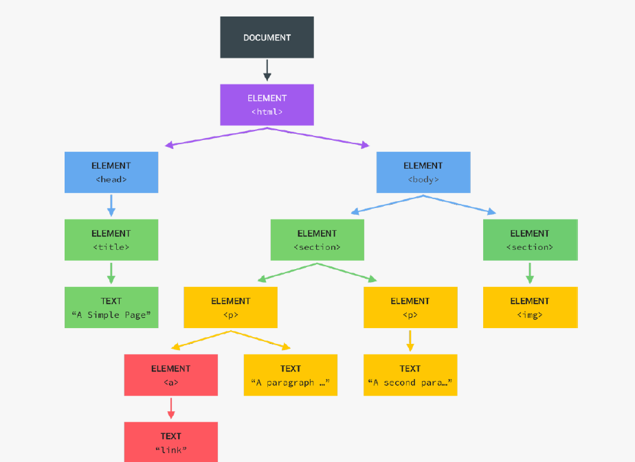

<link href="markdown.css" rel="stylesheet"></link>

# <h2 class="heading center gradient-text">**JavaScript Fundamentals**</h2>

<!--! Javascript Operator Precedence -->
<div class="section">

## <h3 class="sub-heading gradient-text">Javascript Operator Precedence</h3>

<p>JavaScript has a well defined order of operator precedence in which operators are executed. It executes mathematical operators <code>(+, -, \*, /, %)</code> first and then comparison operators <code>(>, <, <=, >=, ==, ===)</code>.</p>

```javascript
const now = 2023;
console.log(now - 1990 > now - 2000); // true
```

<p>Here, <code>"-"</code> mathematical operator is resolved before the <code>">"</code> comparison operator. Thus the result is <code>true</code>.</p>

[Ref: https://developer.mozilla.org/en-US/docs/Web/JavaScript/Reference/Operators/Operator_Precedence#table](https://developer.mozilla.org/en-US/docs/Web/JavaScript/Reference/Operators/Operator_Precedence#table)

</div>

<div class="section">

## <h3 class="sub-heading gradient-text">Type Conversion vs Type Coercion</h3>

<p>Type Conversion is when we manually convert from one type to another.</p>

```javascript
const inputAge = '25';
console.log(inputAge + 18); // "2518"
console.log(Number(inputAge) + 18); // 43
```

<p>Type Coercion happens whenever an operator is dealing with two values that have different types. In that case JavaScript will convert one of the values to match the other value.</p>

```javascript
console.log('I am ' + 25 + ' years old.'); // I am 25 years old.
// converts 25 to string coercively.
console.log('23' - '10' - 3); // 10
console.log('23' + '10' - 3); // 2307
```

<p>Here, <code>"-"</code> operator converts strings to number (if the string can convert to a valid number)</p>
</div>

<div class="section">

## <h3 class="sub-heading gradient-text">Javascript : The Beginning</h3>

<p>Page 34 from theory-lectures-v2.pdf</p>
</div>

# <h2 class="heading center gradient-text">**DOM - Document Object Model**</h2>

<div class="section">

## <h3 class="sub-heading gradient-text">What is DOM ?</h3>

<figure>
    
    <blockquote><figcaption>You know this ain't no 10-second race</figcaption></blockquote>
</figure>

<blockquote>- Dom</blockquote>

- DOM stands for Document Object Model, and it is, basically, a structured representation of HTML documents.
- The DOM allows us to use JavaScript to access HTML elements and styles in order to manipulate them.
- We will be able to change text, change HTML attributes and also change CSS styles from our JavaScript.
- DOM is automatically created by the browser as soon as the HTML page loads. It's stored in a tree structure like this one.
- DOM always starts with the document object, right at the very top of the DOM tree.
- Document is a special object that we have access to in JavaScript. This object serves as an entry point into the DOM.
- Methods are available to traverse the DOM where document object is the entry point. Eg: document.querySelector().
- The first child element of document is usually the HTML element, because that's usually the root element in all HTML documents.
- HTML usually has two child elements, head and body.
- DOM is not a part of the JavaScript language. The DOM and DOM methods are actually part of the web APIs (like timers, fetch API).
- The web API APIs are like libraries that browsers implement (in JavaScript language) and that we can access from our JavaScript code.

<figure>
    
    <figcaption>DOM Tree</figcaption>
</figure>

<p>In this tree, each HTML element is one object.</p>

```html
<html>
  <head>
    <title>A Simple Page</title>
  </head>

  <body>
    <section>
      <p>A paragraph with a <a>link</a></p>

      <p>A second paragraph</p>
    </section>

    <section>
      
    </section>
  </body>
</html>
```

</div>

# <h2 class="heading center gradient-text">**Arrays**</h2>

<div class="section">

## <h3 class="sub-heading gradient-text">Array Methods</h3>

<small>These methods mutates the array</small>

1. `push()` : Add item to the **end** of array
2. `unshift()` : Add item to the **beginning** of array
3. `pop()` : Remove item from the **end** of array
4. `shift()` : Remove item from the **beginning** of array

</div>

# <h2 class="heading center gradient-text">**Objects**</h2>

<div class="section">

## <h3 class="sub-heading gradient-text">'this' keyword</h3>

> source: W3schools

<p><code>this</code> refers to the object</p>
<p>Which object depends on how this is being invoked (used or called).</p>
<p>The this keyword refers to different objects depending on how it is used.</p>

- In an object method, this refers to the object.
- Alone, this refers to the global object.
- In a function, this refers to the global object.
- In a function, in strict mode, this is undefined.
- In an event, this refers to the element that received the event.
- Methods like call(), apply(), and bind() can refer this to any object.

```javascript
const author1 = {
  firstName: 'Stan',
  lastName: 'Lee',
  birthYear: 1922,
  job: 'Author',
  friends: ['Tony', 'Peter', 'Rogers'],

  calcAge: function () {
    this.age = 2023 - this.birthYear;
    return this.age;
  },

  getSummary: function () {
    return `${this.firstName} is a ${this.calcAge()} years old ${
      this.job
    }. He has ${this.friends.length} friends.`;
  },
};
```

</div>

<div class="section">

## <h3 class="sub-heading gradient-text">Dot Notation Vs Bracket Notation</h3>

```javascript
const author1 = {
  firstName: 'Stan',
  lastName: 'Lee',
  birthYear: 1922,
  job: 'Author',
  friends: ['Tony', 'Peter', 'Rogers'],
};
```

<p>We can use both notations to access object properties however dot notation is quick and clean.</p>

```javascript
console.log(author1.lastName); // Lee
console.log(author1['lastName']); // Lee
```

<p>When we need to first compute the value we use bracket notation.</p>

```javascript
const nameKey = 'Name';
console.log(author1['first' + nameKey]); // Stan
console.log(author1['last' + nameKey]); // Lee
```

</div>

# <h2 class="heading center gradient-text">**Functions**</h2>

<div class="section">

## <h3 class="sub-heading gradient-text">Function Declaration vs Function Expression vs Arrow Functions</h3>

<p><b>Function Declaration</b> is a named function.</p>
<p>A declared function can be called before declaration.</p>

```javascript
function calcAge1(birthyear) {
  return 2023 - birthyear;
}
const age1 = calcAge1(1990);
console.log(age1); // 33
```

<p><b>Function Expression</b> is a function value stored in a variable.</p>

<p>A function expression can not be called before declaration due to hoisting.</p>

```javascript
const calcAge2 = function (birthyear) {
  return 2023 - birthyear;
};
const age2 = calcAge2(2000);
console.log(age2); // 23
```

<p><b>Arrow Functions</b> are great for quick one-line functions. They do not have access to the notorious <code>"this"</code> keyword.</p>

```javascript
const calcAge3 = birthyear => 2023 - birthyear;
const age3 = calcAge3(2010);
console.log(age3); //13
```

</div>

# <h2 class="heading center gradient-text">**Interview**</h2>

<div class="section">

## [<p class="gradient-text sub-heading">JavaScript Interview Questions</p>](https://github.com/sudheerj/javascript-interview-questions)

[javascript-interview-questions](https://github.com/sudheerj/javascript-interview-questions)

</div>

# <h2 class="heading center gradient-text">**New Title Heading**</h2>

<div class="section">

## <h3 class="sub-heading gradient-text">New Section Heading</h3>

</div>
